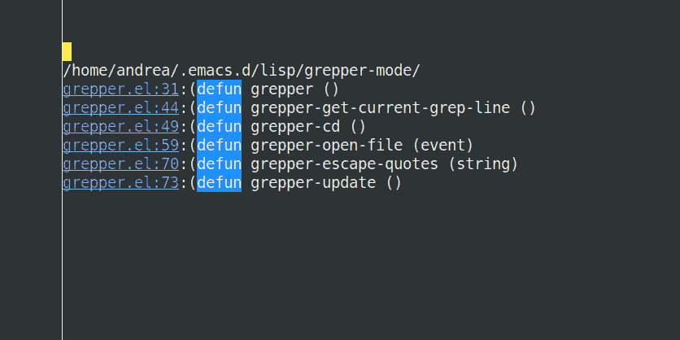

`grepper`
==============

`grepper` is an Emacs major mode for fast grepping. It uses an
interactive interface that allows to grep a directory while entering
each character. Each result has a link that opens the file to the
shown line and column.

This is very hacky, and just something I put together for my own
convenience. Chances are high that someone else already did this in a
better way, but if they did I couldn't find it.

## Usage

The program is launched by using

    M-x grepper

The first line acts as a search bar. Every time the first line it is
in is edited, the first line is extracted and fed into grep, and the
results are listed in the rest of the file.

The search is limited to 50 results to reduce the wait times in case
of short searches. Any search with less than 3 characters is ignored.

The program escapes quotes so they can be used safely. 

## Commands

`grepper-cd` changes the directory to do the searches in. Editing the
second line does nothing (it is just there as to show the current
directory).

## Dependencies

The program uses `ripgrep`, although it is easy to adapt to basic linux
`grep` or any other grep command you want.

